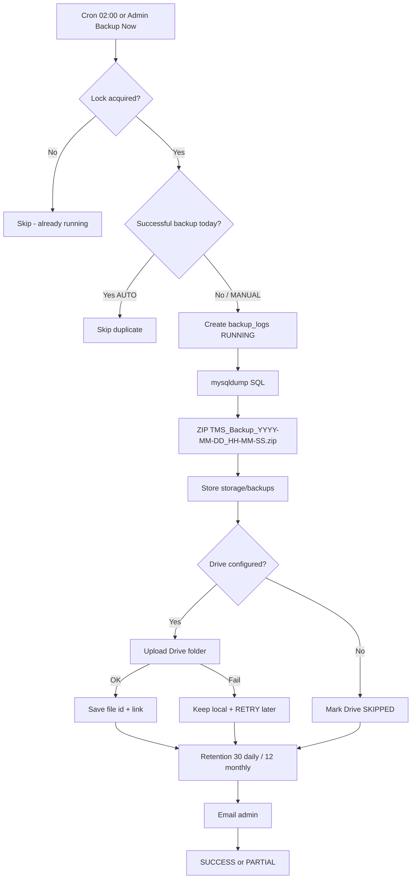
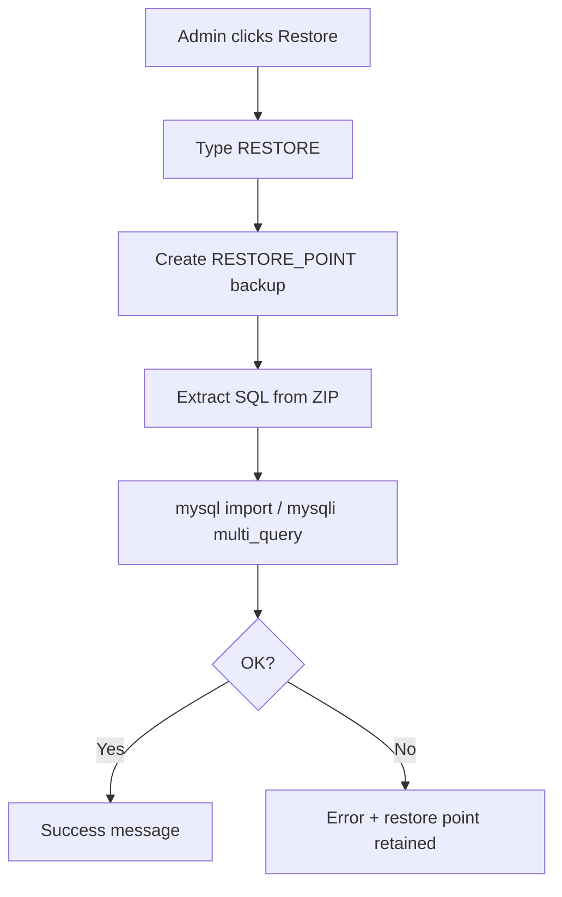

# Enterprise Backup Management System

Production-ready MySQL backup module for TMS with daily automation, ZIP archives, Google Drive sync, restore, and audit logging.

## Files Created

| Path | Purpose |
|------|---------|
| `config/backup.php` | Schedule, retention, Drive, email settings |
| `config/google-drive-service-account.example.json` | Service account template |
| `sql/migrations/2026_07_14_create_backup_logs.sql` | SQL migration |
| `app/BackupSchemaRepository.php` | Auto-creates `backup_logs` |
| `app/BackupRepository.php` | Persistence layer |
| `app/BackupLogger.php` | Structured audit log entries |
| `app/GoogleDriveService.php` | Drive API v3 (JWT service account) |
| `app/BackupService.php` | mysqldump → ZIP → retain → upload → email |
| `app/RestoreService.php` | Restore-point + DB restore |
| `app/BackupScheduler.php` | Cron + web-traffic fallback |
| `app/BackupController.php` | Admin HTTP / AJAX API |
| `views/backup/index.php` | Bootstrap 5 dashboard |
| `public/assets/css/backup-module.css` | Dashboard styles |
| `public/assets/js/backup-module.js` | Backup Now / restore / delete / log |
| `bin/backup-cron.php` | CLI cron entrypoint |
| `docs/BACKUP_SYSTEM.md` | This document |

## Files Modified

| Path | Change |
|------|--------|
| `public/index.php` | Thin `page=backup` → `BackupController::dispatch()` |
| `app/bootstrap.php` | Require backup classes + ensure schema |

**Not modified:** accounting modules, Auth, overall routing scheme (`?page=`), business posting logic.

## SQL Migration

Run once (also auto-applied by `BackupSchemaRepository::ensureSchema`):

```bash
mysql -u root -p tms_db < sql/migrations/2026_07_14_create_backup_logs.sql
```

## Google Drive Setup Instructions

1. Open [Google Cloud Console](https://console.cloud.google.com/).
2. Create or select a project.
3. Enable **Google Drive API**.
4. **IAM & Admin → Service Accounts → Create Service Account**.
5. Create a JSON key and download it.
6. Copy the JSON to:

```text
config/google-drive-service-account.json
```

7. (Recommended) Share a Drive folder with the service account email (`...@....iam.gserviceaccount.com`) as **Editor**, or let the module create `TMS Database Backups` in the service account’s Drive.
8. Set `config/backup.php` → `google_drive.enabled = true`.
9. Optionally set `email.admin_email` for notifications.

> Shared Drives / delegated domain-wide access may be required on restricted Google Workspace tenants.

## Service Account Configuration

```php
// config/backup.php
'google_drive' => [
    'enabled' => true,
    'folder_name' => 'TMS Database Backups',
    'credentials_path' => 'config/google-drive-service-account.json',
    'folder_id' => '', // auto-cached under storage/backups/.gdrive_folder_id
    'max_upload_retries' => 3,
],
```

Never commit the real JSON key. Keep only `*.example.json` in git.

## Cron Job Command

**Linux (02:00 Asia/Colombo):**

```cron
0 2 * * * /usr/bin/php /var/www/tms/bin/backup-cron.php >> /var/www/tms/storage/backups/cron.log 2>&1
```

Adjust the PHP binary and project path for your server.

**Windows Task Scheduler (optional):**

```text
Program: C:\wamp64\bin\php\php8.x.x\php.exe
Arguments: C:\wamp64\www\tms\bin\backup-cron.php
Trigger: Daily at 02:00
```

If cron is unavailable, `BackupScheduler::tickFromWeb()` runs once after 02:00 when an admin opens the Backup page and no successful backup exists for that date.

## Backup Flow



## Restore Flow



## Security Improvements

- Admin-only (`Auth::hasRole('admin')`) for all backup/restore/delete/download actions
- CSRF on all mutating POSTs
- Prepared statements for `backup_logs`
- Filenames validated; downloads confined to `storage/backups`
- `.htaccess` denies direct HTTP access to backup files
- `MYSQL_PWD` env instead of password on CLI where possible
- Service account credentials stored outside the web root pattern (`config/`, not `public/`)
- Restore requires typed confirmation `RESTORE`
- Full audit: user, IP, duration, errors, Drive IDs

## Performance Improvements

- `--single-transaction --quick` mysqldump for InnoDB consistency
- ZIP compression reduces disk + upload size
- File lock prevents concurrent backup races
- Duplicate-day guard for AUTO jobs
- Drive failures do not delete local ZIPs; retries are queued
- Retention prunes old local + Drive artifacts automatically
- Web scheduler exits immediately when today’s backup already exists

## Testing Checklist

- [ ] Open `/public/index.php?page=backup` as admin
- [ ] Confirm KPI cards load and history table renders
- [ ] Click **Backup Now** — progress bar appears; ZIP created under `storage/backups/`
- [ ] Row appears in history with size, duration, status
- [ ] Download ZIP and verify it contains `.sql` + `backup-manifest.json`
- [ ] Without Drive credentials: status `SKIPPED` / `PARTIAL` as designed; local file kept
- [ ] With valid service account: upload succeeds; Drive link stored
- [ ] Trigger `php bin/backup-cron.php` twice — second run skips duplicate day
- [ ] Delete a backup — local file + DB row removed (Drive file removed if uploaded)
- [ ] Restore flow: type `RESTORE`, confirm restore-point created, DB restores
- [ ] Failure email / success email (SMTP configured in `config/mail.php`)
- [ ] Non-admin user receives 403
- [ ] CSRF rejection when token missing
- [ ] Retention: create many test backups and confirm older ones pruned per policy

## Manual Paths (Windows WAMP)

If auto-detect fails, set in `config/backup.php`:

```php
'mysqldump_path' => 'C:\\wamp64\\bin\\mysql\\mysql8.4.7\\bin\\mysqldump.exe',
'mysql_path' => 'C:\\wamp64\\bin\\mysql\\mysql8.4.7\\bin\\mysql.exe',
```
